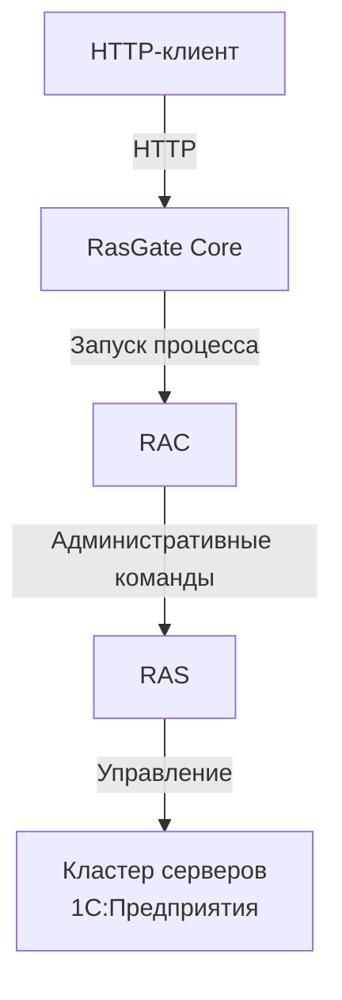

# RasGate

> Минимальный HTTP-адаптер для выполнения команд RAC платформы 1С:Предприятие.

RasGate — лёгкий сервис на ASP.NET Core, предоставляющий доступ к официальной утилите **Remote Administration Client (RAC)** платформы 1С:Предприятие через HTTP.

Вместо локального запуска `rac` клиент отправляет запрос в RasGate. Сервис запускает настроенный исполняемый файл RAC без использования `shell`, получает результат выполнения и возвращает его клиенту.

## 📌 Зачем это нужно?

Официальная утилита `rac` предоставляет интерфейс командной строки.

Она хорошо подходит для локальных сценариев и скриптов, но менее удобна для использования из:

- веб-приложений;
- CI/CD-процессов;
- сервисов оркестрации;
- средств удалённого администрирования;
- распределённой инфраструктуры.

RasGate предоставляет стабильный HTTP-транспорт, не изменяя семантику команд RAC.

## 📐 Основные принципы

- минимальная область ответственности;
- отсутствие shell-вызовов;
- минимальная зависимость от версии RAC;
- отсутствие состояния;
- контролируемое выполнение;
- простота развёртывания.

## ✅ Что делает RasGate

- запускает настроенный исполняемый файл `rac`;
- принимает аргументы RAC через HTTP;
- получает `stdout` и `stderr`;
- возвращает код завершения и метаданные выполнения;
- поддерживает отмену запроса и таймаут выполнения;
- ограничивает количество одновременно запущенных процессов RAC;
- предоставляет спецификацию OpenAPI и Swagger UI в окружении `Development`.

## 🚫 Что RasGate намеренно не делает

RasGate — **не предметный API администрирования 1С**.

Он не:

- предоставляет контроллеры `Cluster`, `Infobase`, `Session` и другие бизнес-контроллеры;
- нормализует различия между версиями RAC;
- интерпретирует вывод RAC;
- предоставляет высокоуровневые модели объектов 1С;
- запускает произвольные программы.

RasGate намеренно остаётся тонким транспортным слоем.

## 🏗️ Архитектура



## 📋 Требования

Для запуска готовой сборки необходимы:

- установленная утилита RAC платформы 1С:Предприятие;
- доступный сервер администрирования RAS;
- Windows или Linux, соответствующие выбранной релизной сборке.

Готовые релизные сборки являются self-contained single-file приложениями и не требуют отдельной установки .NET Runtime.

Для сборки из исходников необходимы:

- .NET SDK 10;
- GNU Make — если используются команды из `Makefile`.

Проект использует целевую платформу `net10.0`.

## 🚀 Быстрый старт

Укажите абсолютный путь к исполняемому файлу `rac` в файле `appsettings.json`, расположенном рядом с исполняемым файлом RasGate.

Пример для Windows:

```json
{
  "Rac": {
    "ExecutablePath": "C:\\Program Files\\1cv8\\8.3.27.2214\\bin\\rac.exe"
  }
}
```

В JSON обратный слеш `\` экранируется, поэтому в пути Windows используется `\\`.

Пример для Linux:

```json
{
  "Rac": {
    "ExecutablePath": "/opt/1cv8/x86_64/rac"
  }
}
```

В Linux путь записывается без дополнительного экранирования.

Запустите RasGate.

Windows:

```powershell
.\RasGate.Web.exe
```

Linux:

```bash
chmod +x ./RasGate.Web
./RasGate.Web
```

По умолчанию RasGate принимает HTTP-запросы по адресу:

```text
http://0.0.0.0:5050
```

Локальная проверка доступности RAC:

```http
GET http://localhost:5050/rac/status
```

Выполнение команды RAC:

```http
POST http://localhost:5050/rac/execute
Content-Type: application/json
```

```json
{
  "arguments": [
    "cluster",
    "list",
    "localhost:1545"
  ]
}
```

В этом примере команды `cluster list` последний аргумент `localhost:1545` — адрес сервера администрирования **RAS**, к которому подключается утилита `rac`.

Значение `localhost:1545` означает, что RAS доступен на той же машине, где запущен RasGate. Если RAS работает на другом сервере, укажите его имя или IP-адрес:

```json
{
  "arguments": [
    "cluster",
    "list",
    "192.168.1.20:1545"
  ]
}
```

## 🔨 Сборка из исходников

Основные команды проекта:

```bash
make build
make test
make release
```

- `make build` — собирает проект;
- `make test` — запускает тесты;
- `make release` — создаёт релизные self-contained single-file сборки.

Для локального запуска из исходников можно использовать стандартные средства .NET SDK.

## ⚙️ Основные настройки

Основные параметры задаются в `appsettings.json`.

```json
{
  "Urls": "http://0.0.0.0:5050",
  "Rac": {
    "ExecutablePath": "C:\\Program Files\\1cv8\\8.3.27.2214\\bin\\rac.exe",
    "TimeoutSeconds": 30,
    "MaxConcurrentProcesses": 4
  }
}
```

| Параметр | Назначение |
|---|---|
| `Urls` | Адреса и порты, на которых RasGate принимает HTTP-запросы |
| `Rac:ExecutablePath` | Абсолютный путь к исполняемому файлу `rac` |
| `Rac:TimeoutSeconds` | Максимальное время выполнения одной команды RAC |
| `Rac:MaxConcurrentProcesses` | Максимальное количество одновременно выполняемых процессов RAC |

## 📡 HTTP API

### Выполнение команды

```http
POST /rac/execute
Content-Type: application/json
```

```json
{
  "arguments": [
    "cluster",
    "list",
    "localhost:1545"
  ]
}
```

RasGate не интерпретирует аргументы и передаёт их утилите RAC в указанном порядке.

### Результат выполнения

RasGate возвращает результат запуска RAC в поле `data`.

Основные поля:

- `exitCode` — код завершения процесса RAC;
- `standardOutput` — стандартный вывод;
- `standardError` — вывод ошибок;
- `durationMilliseconds` — продолжительность выполнения;
- `timedOut` — признак завершения по таймауту.

Значение `success: true` означает, что RasGate успешно обработал HTTP-запрос и получил результат выполнения RAC. Успешность самой команды определяется значением `exitCode`.

## 🔐 Безопасность

RasGate не предоставляет встроенную аутентификацию и принимает переданные клиентом аргументы для запуска утилиты RAC.

По умолчанию приложение слушает `0.0.0.0:5050`, то есть может быть доступно через все сетевые интерфейсы машины.

Не публикуйте RasGate в открытом интернете без дополнительной защиты.

## 🧪 Тестирование через Postman

В репозитории находится готовая коллекция Postman для ручного тестирования HTTP API RasGate.

Файлы расположены в каталоге:

```text
postman/
├── RasGate.postman_collection.json
└── RasGate.postman_environment.json
```

Коллекция содержит:

- проверку доступности RAC;
- выполнение произвольной команды RAC;
- демонстрационные запросы для работы с кластерами серверов 1С:Предприятия.

Для использования:

1. импортируйте коллекцию и окружение в Postman;
2. выберите импортированное окружение;
3. укажите значения переменных:

```text
baseUrl
rasAddress
```

Где:

- `baseUrl` — адрес HTTP-сервиса RasGate, например `http://localhost:5050`;
- `rasAddress` — адрес сервера администрирования RAS, например `localhost:1545`.

Дополнительные переменные, необходимые отдельным командам, добавляются в окружение Postman по мере необходимости.