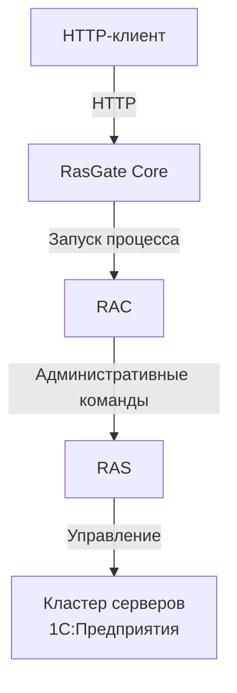

# RasGate

> Минимальный HTTP-адаптер для выполнения команд RAC платформы 1С:Предприятие.

RasGate — лёгкий сервис на ASP.NET Core, предоставляющий доступ к официальной утилите **Remote Administration Client (RAC)** платформы 1С:Предприятие через HTTP.

Вместо локального запуска `rac` клиент отправляет запрос в RasGate. Сервис безопасно запускает настроенный исполняемый файл RAC, получает результат выполнения и возвращает его клиенту.

## Зачем это нужно?

Официальная утилита `rac` предоставляет интерфейс командной строки.

Она хорошо подходит для локальных сценариев и скриптов, но менее удобна для использования из:

- веб-приложений;
- CI/CD-процессов;
- сервисов оркестрации;
- средств удалённого администрирования;
- распределённой инфраструктуры.

RasGate предоставляет стабильный HTTP-транспорт, не изменяя семантику команд RAC.

## Основные принципы

- минимальная область ответственности;
- отсутствие shell-вызовов;
- независимость от версии команд RAC;
- отсутствие состояния;
- безопасное выполнение;
- простота развёртывания.

## Что делает RasGate

- запускает настроенный исполняемый файл `rac`;
- принимает аргументы RAC через HTTP;
- получает `stdout` и `stderr`;
- возвращает код завершения и метаданные выполнения;
- поддерживает отмену запроса и таймаут выполнения;
- ограничивает количество одновременно запущенных процессов RAC;
- предоставляет OpenAPI и Swagger.

## Что RasGate намеренно не делает

RasGate — **не предметный API администрирования 1С**.

Он не:

- предоставляет контроллеры Cluster, Infobase, Session и другие бизнес-контроллеры;
- разбирает справку RAC;
- нормализует различия между версиями RAC;
- интерпретирует вывод RAC;
- предоставляет высокоуровневые модели объектов 1С;
- запускает произвольные программы.

RasGate намеренно остаётся тонким транспортным слоем.

## Архитектура

